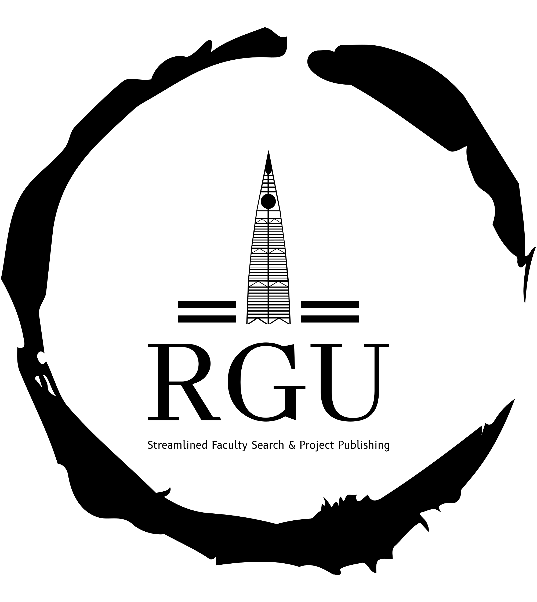

# RGU - Riyadh Gate Universities



## Overview
RGU (Riyadh Gate Universities) is a command-line interface (CLI) system designed to streamline the process of searching for faculty members across multiple universities in Riyadh, namely King Saud University, Prince Sattam bin Abdulaziz University, and Princess Nourah bint Abdulrahman University. The system also allows students to publish their graduation projects and provides investors a platform to explore and invest in these projects.

## Features 
- **User Registration**: Supports registration for three types of users: faculty members, students, and investors.
- **Faculty Member Search**: Enables users to search for faculty members by name across the three universities KSU , PNU and PSAU.
- **Email Functionality**: Allows users to email any faculty member listed in the dataset directly from the system.
- **Graduation Project Publication**: Students can publish their graduation projects, including detailed descriptions.
- **Investor Access**: Investors can browse published graduation projects and contact students for potential investments.

## User Stories
### Faculty Member
As a faculty member, I want to:
- Register and create my profile on the system.
- Be searchable by students and investors for collaboration and consultation.
- Receive emails directly through the system.

### Student
As a student, I want to:
- Register and create my profile on the system.
- Search for faculty members for guidance and assistance.
- Publish my graduation project with detailed information .
- Receive inquiries from investors interested in my project.

### Investor
As an investor, I want to:
- Register and create my profile on the system.
- Search for faculty members for potential research collaborations.
- Browse published graduation projects to find investment opportunities.
- Contact students directly through the system.

## Usage
### Registration
1. Run the RGU CLI.
2. Select the registration option.
3. Choose your user type (faculty member, student, or investor).
4. Enter the required information to complete the registration process.

### Searching for Faculty Members
1. Run the RGU CLI.
2. select registration option.
3. Select the search option.
4. Enter the search criteria (e.g., name).
5. view detailed information.
6. Use the email option to contact the faculty member directly.

### Publishing Graduation Projects (Students)
1. Run the RGU CLI.
2. Log in with your student account.
3. Select the option to publish a graduation project.
4. Enter the project details and upload the PDF file.

### Exploring Graduation Projects (Investors)
1. Run the RGU CLI.
2. Log in with your investor account.
3. Select the option to browse graduation projects.
4. view detailed information.
5. Use the email option to contact the student directly.

## Getting Started
### Prerequisites
- Python 3.12
- 
### Installation
1. Clone the repository:
    ```bash
    git clone https://github.com/9twy/UNIT-1-PROJECT.git
    ```
2. Navigate to the project directory:
    ```bash
    cd UNIT-1-PROJECT
    ```
3. Install the required dependencies:
    ```bash
    pip install -r requirements.txt
    ```

### Running the Application
1. Navigate to the project directory:
    ```bash
    cd UNIT-1-PROJECT
    ```
2. Run the application:
    ```bash
    python main.py
    ```

## Contributing
We welcome contributions to the RGU project. To contribute, please follow these steps:
1. Fork the repository.
2. Create a new branch (`git checkout -b feature-branch`).
3. Make your changes and commit them (`git commit -m 'Add new feature'`).
4. Push to the branch (`git push origin feature-branch`).
5. Create a pull request.


## Contact
For questions or support, please contact [saeed.abdullah.alghamdi@outlook.sa].
